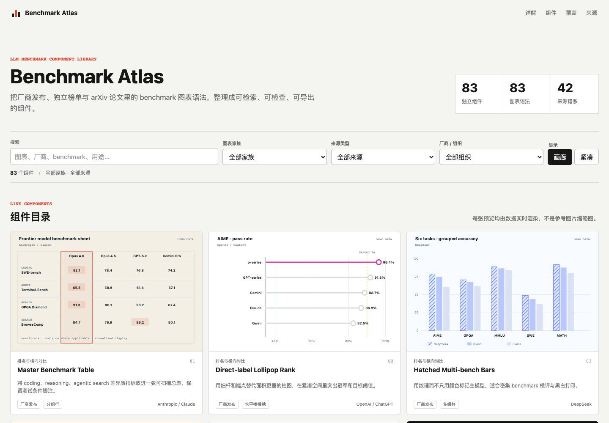

# Benchmark Atlas

[](LICENSE)

A source-grounded, duplication-checked component atlas for LLM benchmark
charts, model launch comparisons, independent leaderboards, and research-paper
figures.

[Live catalog](https://aidennovak.github.io/llm-benchmark-atlas/) ·
[Chinese README](README.zh-CN.md) ·
[Component contract](docs/COMPONENT_CONTRACT.md) ·
[Browser API](docs/API.md) ·
[JSON Schema](schema/catalog.schema.json) ·
[Source inventory](research/SOURCES.md)



## What makes it useful

Benchmark screenshots are abundant, but reusable chart grammar is not. The
same bar chart is frequently copied into several folders, recolored for a new
vendor, and counted again. Benchmark Atlas uses a stricter unit of value:

- **71 live SVG components** generated from structured data
- **71 unique chart grammars**, renderers, and visual-system identifiers
- **35 source lineages** across vendors, leaderboards, labs, and arXiv papers
- **10 chart families** from ranking and uncertainty to agent trajectories
- search, multi-axis filtering, enlarged inspection, JSON access, and SVG export
- validation that fails on duplicates, missing sources, invalid SVG values, or
  missing accessibility metadata

Changing only a color, model name, or file format does not create a new
component.

## Quick start

No build step or runtime dependency is required.

```bash
git clone https://github.com/AidenNovak/llm-benchmark-atlas.git
cd llm-benchmark-atlas
npm run validate
npm run serve
```

Open <http://127.0.0.1:4173/library/>.

The public site is normally deployed from the `gh-pages` branch. Maintainers can
publish the validated static bundle without a hosted runner:

```bash
npm run deploy:pages
```

Run the same interaction suite against production with:

```bash
npm run qa -- https://aidennovak.github.io/llm-benchmark-atlas/
```

## Coverage

| Family | Representative components |
|---|---|
| Ranking and comparison | master table, lollipop rank, grouped hatch, slopegraph, bump chart |
| Scale, cost, and efficiency | compute frontier, thinking saturation, log-log scaling, Pareto, bubbles |
| Multi-dimensional profile | radar, facets, parallel coordinates, polar rose, glyph matrix |
| Distribution and uncertainty | forest interval, violin, box plot, ridgeline, ECDF, calibration |
| Diagnostics and matrices | heatmap, confusion matrix, context decay, ablation waterfall, win matrix |
| Agent and process evaluation | long-horizon ledger, token area, swimlane, Sankey, survival, solve curve |
| Special encoding and coverage | cylinders, waffle, treemap, beeswarm |
| Vendor release reproductions | Gemini triptych, OpenAI thinking pairs, Claude intervals, TML frontier |
| Figure-verified Asian labs | Kimi scaling and systems, MiniMax efficiency and data coverage, GLM curriculum and parameter frontier |

The source lineages include OpenAI/ChatGPT, Anthropic/Claude, Google/Gemini,
DeepSeek, Qwen, Meta/Llama, Mistral, xAI/Grok, Microsoft/Phi, Amazon Nova,
Cohere, NVIDIA/Nemotron, Thinking Machines Lab, LMArena, Artificial Analysis,
OpenCompass, HELM, SWE-bench, Terminal-Bench, LiveCodeBench, and others.

## Architecture

The project deliberately stays framework-free so every chart is inspectable and
exportable.

```text
library/catalog.js       source registry, component metadata, demo data
library/renderers.js     40 core pure-SVG renderers
library/vendor-series.js vendor-specific extension registry and renderers
library/research-series.js vendor detail and paper-figure extension series
library/asian-series.js  figure-verified Kimi research series
library/lab-series.js    figure-verified MiniMax and GLM research series
library/api.js           stable query, render, and extension API
library/catalog.generated.json machine-readable registry snapshot
library/app.js           search, filters, details, JSON copy, SVG download
scripts/validate-*       contract and runtime validation
research/                source evidence and chart taxonomy
```

See [Architecture](docs/ARCHITECTURE.md) for the data flow and extension model.

## Add a chart

Every contribution must add material information value:

1. cite a first-party, leaderboard, or paper source;
2. explain the benchmark story the chart is good at telling;
3. provide a new grammar, visual-system ID, and pure renderer;
4. mark illustrative data clearly or add a versioned data citation;
5. pass `npm run validate` and mobile visual QA.

Read [CONTRIBUTING.md](CONTRIBUTING.md) and use the new-chart issue template
before implementing a large series.

## Data and trademark policy

Preview values are illustrative and visibly marked `DEMO DATA`. Source links
document lineage; they do not imply endorsement or claim that the preview is a
current leaderboard. See [NOTICE.md](NOTICE.md) and
[Data policy](docs/DATA_POLICY.md).

## Roadmap

The next releases focus on versioned real-data adapters, an ESM package API,
more verified model-lab sources, visual regression snapshots, and
additional chart grammars only where a real evaluation use case justifies them.
See [ROADMAP.md](docs/ROADMAP.md).

## License

The project code is available under the [MIT License](LICENSE). Third-party
names and benchmark marks remain the property of their owners.
